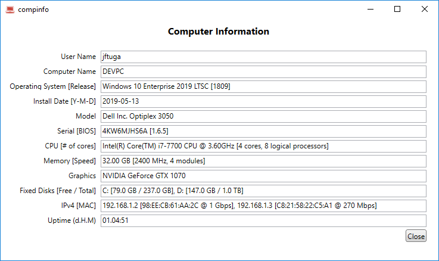

# CompInfo

## Display basic computer info

Including user name, computer name, OS, model, serial number (service tag), CPU model, memory, IPv4 address and uptime

 

[compinfo.exe download](https://github.com/jftuga/compinfo/blob/master/compinfo/bin/Release/compinfo.exe)

____

Icon source: http://www.iconarchive.com/show/origami-colored-pencil-icons-by-double-j-design/red-laptop-icon.html
